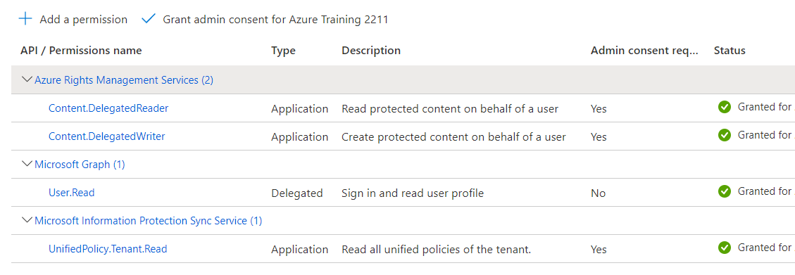

<!-- NO TITLE IN ARTICLE !!! -->

Configuring AIP UL Scanner is a lengthy process and has some nasty pitfalls. Read in this post how to get an API Filescanner running successfully.
<!--more-->

The API UL Scanner allows you to assign MIP Sensitivity labels to local files. These files can be stored in different repositories: file server, NAS devices or local SharePoint sites. With a correctly configured scanners DLP policies could be enforced too. For further information about abilities and features take a look into the [documentation](https://learn.microsoft.com/en-us/azure/information-protection/deploy-aip-scanner).

To install and configure the AIP UL Scanner (short Scanner) a lot of requirements must be meet. A list of them could be found in the [documentation](https://learn.microsoft.com/en-us/azure/information-protection/deploy-aip-scanner-prereqs), but unfortunately there are more.

### AAD Connect

The first additional requirement is a AAD Hybrid Configuration with your on premises Active Directory. It is necessary to sync the service account used by the Scanner to the AAD. This account therfore, must have an UPN capable for signing in to the AAD. All authentication configurations (PHS, PTA and AD FS) could be used.

After you have synced successfully the user, assign a licence for information protection in AAD.

On premises assign the _Log on locally_ and _Log on as service_ user right. These assignments are importment for the installation. Permanently the user needs permissions to read and write files in the repositories.

### On premises Infrastructure

Install the SQL Server, the [AIP UL client](https://www.microsoft.com/en-us/download/details.aspx?id=53018) and the Micorsoft Office iFilter according to the documentation.

Note, that the AIP UL client is currently in maintenance mode. This means MS will replace that client in the future. For further information read that [blog](https://techcommunity.microsoft.com/t5/security-compliance-and-identity/announcing-aip-unified-labeling-client-maintenance-mode-and/ba-p/3043613).

### Create Sensitivity Label

[Here](https://learn.microsoft.com/en-us/azure/information-protection/deploy-aip-scanner-prereqs#label-configuration-requirements) in the documentation you could read that a sensitivity label is required. To be precise you need at least one label and it should have an auto-labeling configuration (not an auto-labeling policy) and a label policy.

A label with auto-labeling configuration is created with the following properties:

- Set the scope to _Items_.
- Choose the protection settings (_Encypt item_, _Mark items_) as you like
- Turn on _Auto-labeling for files and emails_.
  - configure a conditions to find sensitive information in files
  - set _When content matches these conditions_ to __Automatically apply the label__

Of course, at this moment, you should have already finished the configuration of SITs or EDM and tested extensively.

This label must be applied to the Scanner, actually the synced Scanner account. For this use a labe policy. Again: not an auto-label policy.

### AAD App Registration

In AAD an app must be registered so that the Scanner can establish an authenticated connection to some services hosted in Azure. This is the second requirement not clearly documented. But [here](https://learn.microsoft.com/en-us/azure/information-protection/rms-client/clientv2-admin-guide-powershell#create-and-configure-azure-ad-applications-for-set-aipauthentication) in the AIP Client Admin Guide you could find a step-by-step guide for registering the app and assigning permission to it. The app must have the following configurations:

- Authentication/Platform: Web, Redirect URI `https://localhost`
- Certificate & secret: Client secret.
- API Permissions: 

### Preparing Scanner in MS Purview

To do that, follow [that](https://docs.microsoft.com/en-us/azure/information-protection/deploy-aip-scanner-configure-install?tabs=azure-portal-only#overview) instructions.

At the [_Get an Azure AD token for the scanner_](https://learn.microsoft.com/en-us/azure/information-protection/deploy-aip-scanner-configure-install?tabs=azure-portal-only#get-an-azure-ad-token-for-the-scanner) point  consider the following:

``` powershell
$appid = '<AppId/ClientID>'
$appsecret = '<AppSecret>'
$tenantid = '<TenantID>'
$delegatedUser = '<syncedAIPUser>'

Set-AipAuthentication -AppId -AppSecret -TenantId -DelegatedUser 
```

> Hint: The AppSecret can only be seen in clear text at the moment of creation not later. The delegated User is the user mentioned [here](#aad-connect).
