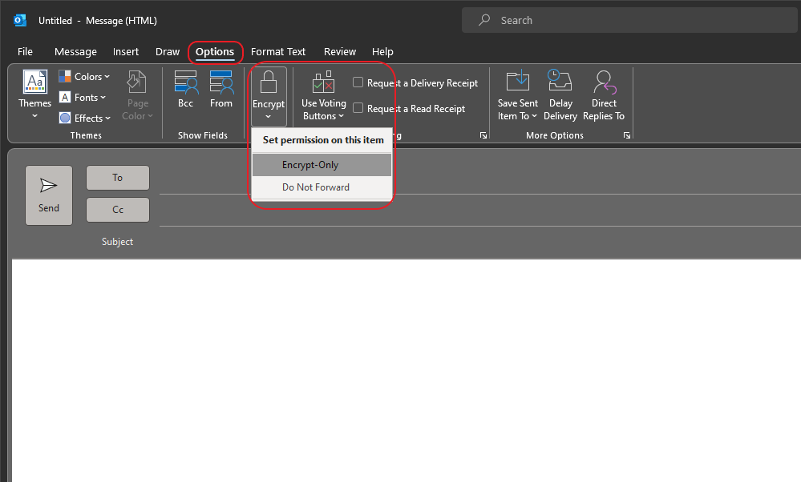
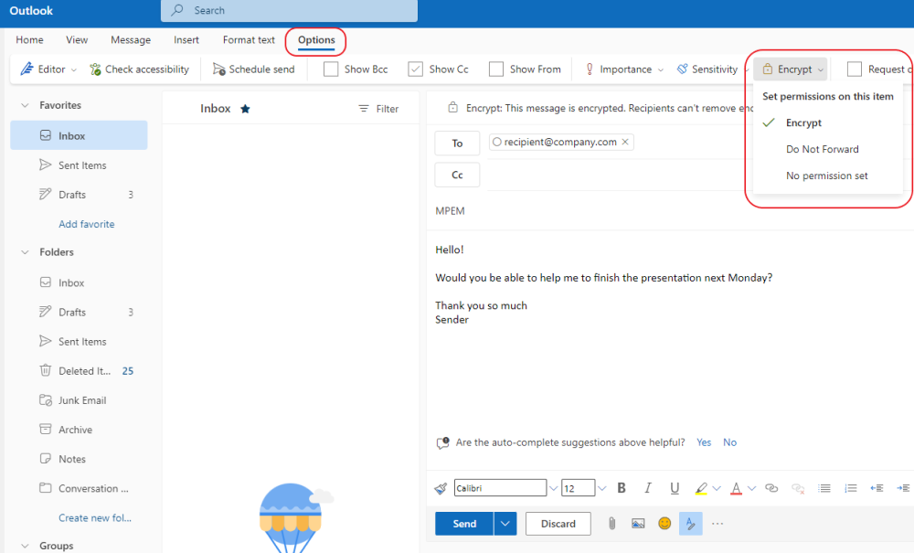

<!-- NO TITLE IN ARTICLE !!! -->

This post describes how to work with MS Purview Message Encrpytion formerly knows as OME (Office Message Encryption). Activation, configuration and usage of that service is described in this article.
<!--more-->

MS Purview Message Encryption (MPME) is one way to encrypt messages in Office 365. This service is built on Azure Rights Management, which is part of Azure Information Protection. You can send encrypted mails to receipients in- and outside of your organization, regardless of the destination email address.

Two other ways to encrypt messages in Microsoft 365 is S/MIME and Information Rights Management (IRM). For more information on all types see the [documentation](https://learn.microsoft.com/en-us/microsoft-365/compliance/email-encryption?view=o365-worldwide).

## What could you expect from MPME?

In short:

- sending encrypted messages
- sending encrypted messages and prevent forwarding and printing
- receive encrypted messages and read the content without any other actions
- non-Microsoft mail accounts must use a web portal to read a mail. Authentication is required.
- setting the encryption manually by users or automatically via mail flow rules.

## MPME vs. MP advanced ME

MPME is available in two different form: MPME and Microsoft Purview Advanced Message Encryption. Second one offers in addition multiple templates, message revocation and message expiration.

| Type | License requirement |
| --- | --- |
| MPME (basic) | Azure Information Protection Plan 1 to the following plans: Exchange Online Plan 1 or 2, Office 365 F3, Microsoft 365 Business Basic or Standard, or Office 365 Enterprise E1 To receive Microsoft Purview Message Encryption |
| MPME (advanced) | Microsoft E3/E5 or Office 365 E3/E5 |
[Source](https://learn.microsoft.com/en-us/office365/servicedescriptions/exchange-online-service-description/exchange-online-service-description)

## How to activate MPEM?

MPEM is activated automatically for all tenants with approriate licences. To check that use the following command. The result should be `True`.

```powershell
#Requires -Modules ExchangeOnlineManagement

(Get-IRMConfiguration).AutomaticServiceUpdateEnabled
```

If you have to activate that service manually perform the following:

```powershell
#Requires -PSEdition Desktop

Install-Module -Name AIPService
Connect-AipService

Enable-AipService

# to check activation
Get-AipService
```

The result of the last command should be `Enabled`.

## Usage by sender

As the sender or author of message which should be sent encrypted, the user has to change just a single option in Outlook for Desktop or Outlook for Web:





> Hint: The option `Encrypt` would encrypt the content of the mail and all attachments, while the option `Do Not Forward` would prevent the forwarding, printing and content copying by the recipient.

## Usage by recipient

Let's assume the recipient works on a desktop and is using a mail client like Outlook for Desktop, Thunderbird or a web portal. Afte mail appears in the inbox it must be opend in Outlook by double clicking. In other mail clients like Outlook for Web the unencrypted part of the message could be read immediately. After clicking the `Read` button the recipient is redirected to a web portal where an additional authentication must be initiated.

This could be a social or OTP sign is, depending of the configuration of the branding template.

In that portal, an answer or - if allowed - a forwarding could be done. Not in the mail client app of the user.

## How to create or change message templates?

In case of using MP advanced Message Encryption it is possible to create multiple branding templates. These templates must be applied by mail flow rules and cannot be selected by end users.

Use the following commands as reference to create, change and delete branding templates:

```powershell
#Require ExchangeOnlineManagement

Connect-ExchangeOnline


# Get a list of current existing templates in your tenant.
Get-OMEConfiguration

# Create a new template
New-OMEConfiguration -Identity '<customTemplateName>' -IntroductionText 'Message Encrypted.'

# Change any settings for a template
Set-OMEConfiguration -Identity '<customTemplateName>' -IntroductionText 'This message is encrypted. It is ...' -ReadButtonText 'Unencrypt Message' -PortalText 'Please sign in to read the message.'

# Delete a template
Remove-OMEConfiguration -Identity '<customTemplateName>'
```

>Hint: Consider using additional parameters like `-SocialIDSignIn`, `-OTPEnabled`, `-ExternalMailExpiryInDays` or `-PrivacyStatementUrl` to enrich recipient's experiance.

## Working with mail flow rules

To use MPEM automatically for all or selected mails or to use different branding templates for different senders or recipients mail flow rules are necessary. To configure that rules navigate to the [Exchange administration portal](https://admin.exchange.microsoft.com) and sign in as Exchange admin.

Click in the navigation pane on _**Mail flow**_ and then the item _**Rules**_. Create a new rule by selecting the template _Create new Rule_ or _Apply Office 365 Message Encryption and rigts protection to messages_. Any rule template is working as long as the action group in the rule is set to `Modify the message security`.

The action `Apply Office 365 message Encryption ...` needs you to configure a RMS template. There are the built-in templates `Encrypt` and `Do not forward` available as well as the self created sensitiviy labels with configured encryption settings.

Additional predicates like sender, recipient, recipient domain and some more could be configured to have different brandings for different languages in use e. g.
